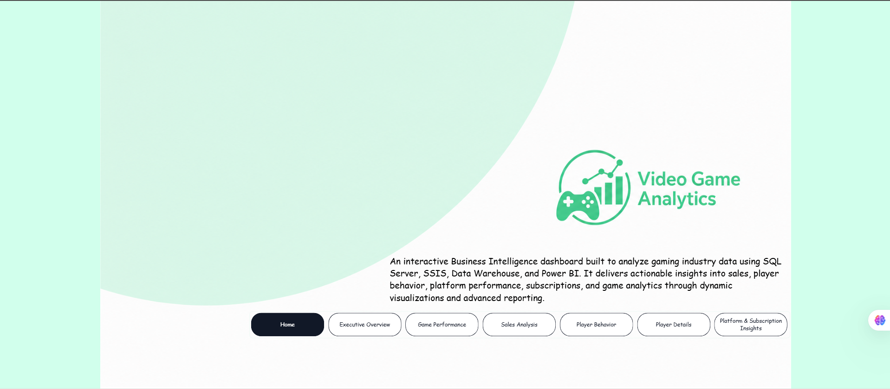
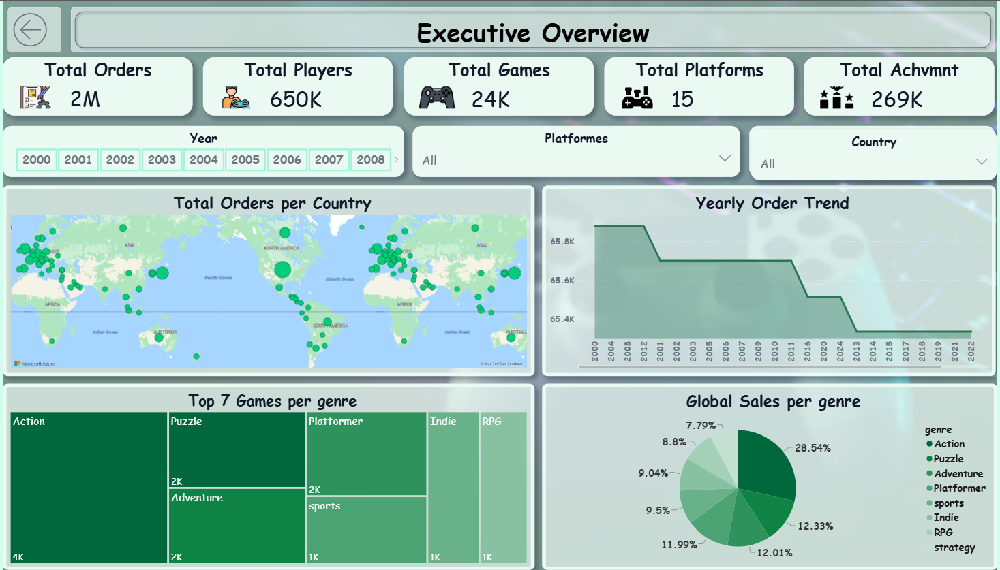
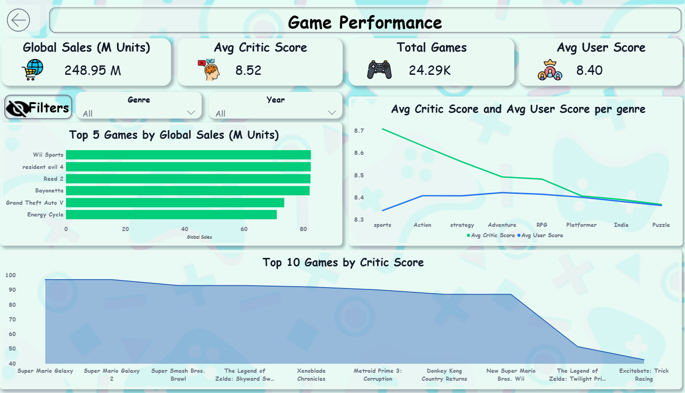
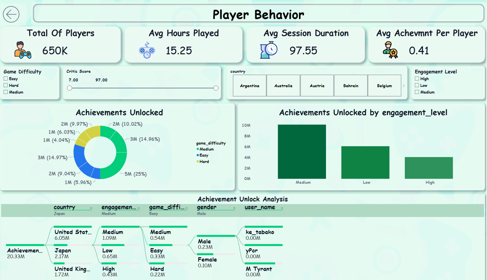
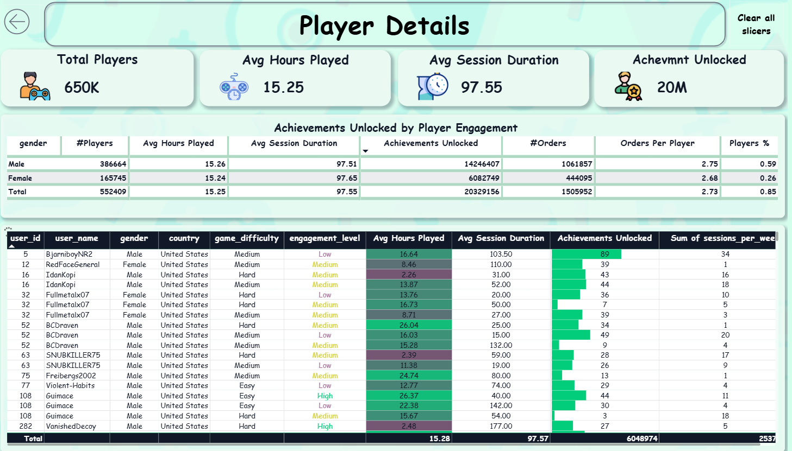
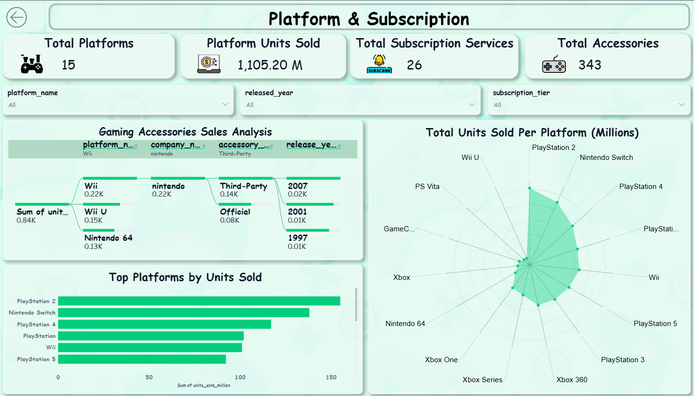

# 🎮 Video Game Analytics Platform

An end-to-end Business Intelligence platform that analyzes video game sales, player behavior, platform performance, and market trends using modern BI technologies.

---

## 📊 Live Demo

🌐 Website:
[https://YOUR-WEBSITE](https://video-game-analysis-web-p73h.vercel.app/)

📈 Power BI Dashboard:
[https://YOUR-POWERBI](https://app.powerbi.com/view?r=eyJrIjoiMWUzOTNjMDgtNDhjOS00MDljLTgyNTgtZGQ0ZjliZGE5ZTM1IiwidCI6ImQ1YjAyZWU0LTNiYjItNDBlZS1iMTJhLWEyZGM5NzVjMWVhZSJ9)


---

## 🚀 Project Overview

This project demonstrates the complete Business Intelligence lifecycle, from collecting and transforming raw data to building an Enterprise Data Warehouse and delivering interactive dashboards.

The platform enables users to:

- Analyze global video game sales
- Monitor player engagement
- Compare gaming platforms
- Explore subscription services
- Track accessories performance
- Generate AI-powered insights

---

# 🛠 Tech Stack

- SQL Server
- SSIS
- SSAS
- Power BI
- Tableau
- Excel
- Python
- Pandas
- DAX
- OpenRouter AI

---

# 🏗 Architecture

Raw Data

↓

Data Cleaning

↓

Data Transformation

↓

SQL Server Database

↓

ETL (SSIS)

↓

Enterprise Data Warehouse

↓

SSAS Cubes

↓

Power BI / Tableau / Excel

↓

AI Assistant

---

# 📷 Dashboards

## Home



---

## Executive Overview



---

## Sales Analysis


---

## Game Performance



---

## Player Behavior



---

## Player Details



---

## Platform & Subscription



---

# 📈 Key Features

✔ Enterprise Data Warehouse

✔ ETL Pipelines (SSIS)

✔ SSAS Analytical Cubes

✔ Power BI Dashboards

✔ Tableau Dashboards

✔ Excel Dashboards

✔ DAX Measures & KPIs

✔ AI Assistant

✔ Interactive Reports

---

# 🤖 AI Assistant

Integrated AI assistant that allows users to ask questions in natural language and receive analytical insights.

---

# 📂 Repository Structure

```
Video-Game-Analytics
│
├── Gaming_Analytics_T3.pbix
├── Screenshots
├── README.md
```

---

# 👨‍💻 Author

Ahmed Esam

LinkedIn:
(https://www.linkedin.com/in/ahmed-esam-1802ba202/?lipi=urn%3Ali%3Apage%3Ad_flagship3_feed%3BJdA%2BIsw7T%2FOmqv%2B0QbydRg%3D%3D)

Portofolio:
https://ahmed-esam-portfolio.vercel.app/#
